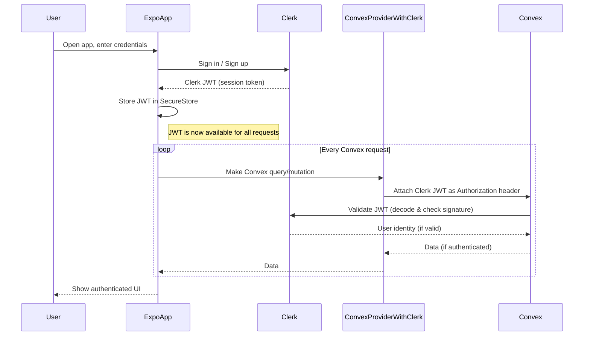

# 🚀 Clerk + Convex + Expo Example

This project demonstrates a full-stack authentication and data flow using:

- **[Clerk](https://clerk.com/):** Authentication and user management
- **[Convex](https://convex.dev/):** Backend/database with real-time capabilities
- **[Expo](https://expo.dev/):** React Native app platform with file-based routing

It is based on the official Clerk and Convex quickstart templates, with comprehensive JSDoc documentation and extra notes for quirks and integration details.

---

## 📋 What This Project Does

- **Authentication Flow**: Provides sign-in/sign-up with email verification using Clerk
- **Session Management**: Handles secure token storage with Expo SecureStore
- **Real-time Data**: Uses Convex for backend/database with real-time capabilities
- **Protected Routes**: Demonstrates authentication-based navigation and route protection
- **User Data**: Shows user-owned task list where each user's data is private and authenticated
- **JWT Integration**: Passes Clerk JWT tokens to Convex for authenticated backend queries
- **No User Sync**: All user identity is derived live from Clerk JWT via `ctx.auth.getUserIdentity()`
- **TypeScript**: Fully typed with comprehensive JSDoc documentation
- **Modern UI**: Clean, responsive design with proper loading states and error handling

---

## 🛠️ Setup Instructions

### 1️⃣ Clerk Setup

1. [Create a Clerk account](https://clerk.com/)
2. Create a new Clerk application in the Clerk dashboard
3. Copy your **Publishable Key** and set it in your `.env` or `.env.local` as:
   ```env
   EXPO_PUBLIC_CLERK_PUBLISHABLE_KEY=your-clerk-publishable-key
   ```
4. In the Clerk dashboard, go to **API Keys** and note your instance domain (e.g., `https://your-app.clerk.accounts.dev`)

### 2️⃣ Convex Setup

1. [Create a Convex account](https://dashboard.convex.dev/) and a new project
2. Copy your Convex deployment URL and set it in your `.env` as:
   ```env
   EXPO_PUBLIC_CONVEX_URL=your-convex-url
   ```
3. In `convex/auth.config.ts`, set the `domain` to your Clerk instance domain (see above):
   ```ts
   // convex/auth.config.ts
   const authConfig = {
     providers: [
       {
         domain: "https://your-app.clerk.accounts.dev",
         applicationID,
       },
     ],
   };
   ```
4. Deploy your Convex backend after making this change

### 3️⃣ Install Dependencies

```sh
npm install
npx expo install expo-secure-store
```

### 4️⃣ Run the App

```sh
npx expo start
```

---

## ⚠️ Important Quirks & Gotchas

> **Note:** These are common stumbling blocks and tips for smooth development.

- **No User Sync Needed:** Convex does not require a user table to be synced with Clerk. All user identity is checked live via JWT on every request.
- **Token Sync:** Convex and Clerk auth state are not always in sync instantly. Use `useConvexAuth()` to check if Convex is ready before running authenticated queries.
- **ConvexProviderWithClerk:** This provider automatically passes the Clerk JWT to Convex. You do not need to manually fetch or set the token.
- **Auth Config Domain:** The `domain` in `auth.config.ts` must match your Clerk instance's issuer (not your Convex URL!). If you see `No auth provider found matching the given token`, check this value.
- **Session Persistence:** The app uses `expo-secure-store` for Clerk session tokens. If you have session issues, try clearing SecureStore or reinstalling the app.
- **Navigation Flash:** The app includes a small delay to prevent flash of incorrect content during startup. This is handled in the `InitialLayout` component.
- **TypeScript:** All components are fully typed with JSDoc documentation. Avoid using `any` types where possible.
- **Never Edit node_modules:** Ignore warnings or errors from `node_modules/convex/tsconfig.json`—these do not affect your app.
- **Development Keys:** Clerk will warn if you use development keys in production. Always use production keys for deployed apps.

---

## 🏊‍♂️ Auth Flow Swim Lane Diagram

Below is a swim lane diagram showing the authentication flow and token sync between Expo (React Native), Clerk, and Convex:



**Key Points:**

- After sign-in/sign-up, Clerk issues a JWT to the Expo app
- Expo stores the JWT in SecureStore (or similar)
- **The ConvexProviderWithClerk automatically retrieves the current Clerk JWT from Clerk and attaches it as an Authorization header to every Convex request**
- You do not need to manually fetch or set the token; the provider keeps it in sync with Clerk’s session state
- Convex validates the JWT with Clerk on every request (no local user table needed)
- Clerk is always the source of truth for user identity

---

### How ConvexProviderWithClerk Handles the JWT Exchange

- The `ConvexProviderWithClerk` (from `convex/react-clerk`) automatically retrieves the current Clerk JWT from the Clerk session.
- On every Convex query or mutation, the provider attaches the JWT as an Authorization header to the request.
- You do **not** need to manually fetch or set the token; the provider keeps it in sync with Clerk’s session state.
- When the Clerk session changes (sign-in, sign-out, token refresh), the provider updates the JWT automatically for all future Convex requests.

**In summary:** The provider abstracts away the token management, ensuring Convex always receives a valid, up-to-date Clerk JWT for every request.

---

## 📁 File Structure

```
├── app/                          # Expo Router app directory
│   ├── _layout.tsx              # Root layout with auth providers
│   ├── sign-in.tsx              # Sign-in screen with form validation
│   ├── sign-up.tsx              # Sign-up screen with email verification
│   └── (tabs)/                  # Tab navigation group
│       ├── _layout.tsx          # Tab navigation layout
│       ├── index.tsx            # Home screen with auth status
│       └── tasks/
│           └── index.tsx        # Tasks screen with CRUD operations
├── convex/                      # Convex backend functions
│   ├── auth.config.ts           # Clerk authentication configuration
│   ├── schema.ts                # Database schema definitions
│   ├── tasks.ts                 # Task-related queries and mutations
│   └── whoami.ts                # User identity query
├── assets/                      # Static assets (images, fonts)
├── android/                     # Android-specific configuration
└── package.json                 # Dependencies and scripts
```

### Key Files

- **`app/_layout.tsx`**: Root layout with Clerk and Convex providers, handles authentication-based navigation
- **`app/sign-in.tsx`**: Sign-in screen with email/password authentication
- **`app/sign-up.tsx`**: Sign-up screen with email verification flow
- **`app/(tabs)/index.tsx`**: Home screen displaying auth status and Convex data
- **`app/(tabs)/tasks/index.tsx`**: Task management screen with real-time data
- **`convex/tasks.ts`**: Backend functions for task CRUD operations
- **`convex/whoami.ts`**: User identity query for debugging auth state

---

## 🚀 Quick Start

1. **Install dependencies**
   ```bash
   npm install
   ```

2. **Set up environment variables**
   ```bash
   # Create .env file with your keys
   EXPO_PUBLIC_CLERK_PUBLISHABLE_KEY=your-clerk-key
   EXPO_PUBLIC_CONVEX_URL=your-convex-url
   ```

3. **Configure Convex auth**
   - Update `convex/auth.config.ts` with your Clerk domain
   - Deploy your Convex backend

4. **Start the app**
   ```bash
   npx expo start
   ```

## 📚 References

- [Clerk Expo Quickstart](https://github.com/clerk/clerk-expo-quickstart)
- [Convex Docs: Auth with Clerk](https://docs.convex.dev/auth/clerk)
- [Expo Router Documentation](https://docs.expo.dev/router/introduction/)
- [Expo Documentation](https://docs.expo.dev/)

## 🛠️ Development

### Available Scripts

- `npm start` - Start the Expo development server
- `npm run android` - Run on Android device/emulator
- `npm run ios` - Run on iOS device/simulator
- `npm run web` - Run in web browser

### Development Options

You can open the app in:
- [Development build](https://docs.expo.dev/develop/development-builds/introduction/)
- [Android emulator](https://docs.expo.dev/workflow/android-studio-emulator/)
- [iOS simulator](https://docs.expo.dev/workflow/ios-simulator/)
- [Expo Go](https://expo.dev/go) (limited sandbox)

### Code Structure

This project uses [file-based routing](https://docs.expo.dev/router/introduction/) with Expo Router. All screens are in the `app/` directory with comprehensive JSDoc documentation.

## 🤝 Contributing

1. Fork the repository
2. Create a feature branch
3. Make your changes with proper JSDoc documentation
4. Test thoroughly
5. Submit a pull request

## 📄 License

This project is open source and available under the [MIT License](LICENSE).
