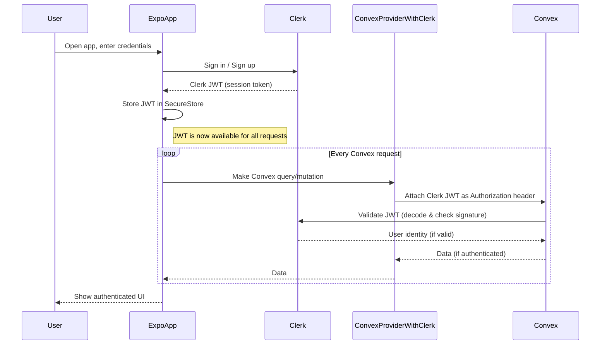

# 🚀 Clerk + Convex + Expo Example

This project demonstrates a full-stack authentication and data flow using:

- **[Clerk](https://clerk.com/):** Authentication
- **[Convex](https://convex.dev/):** Backend/database
- **[Expo](https://expo.dev/):** React Native app platform

It is based on the official Clerk and Convex quickstart templates, with extra notes for quirks and integration details.

---

## 📋 What This Project Does

- Provides sign-in/sign-out and session management using Clerk
- Passes the Clerk JWT token to Convex so backend queries are authenticated
- Uses Convex to run protected queries (e.g., `whoami`) that require a valid Clerk user
- Shows how to sync authentication state between Clerk and Convex in a React Native/Expo app
- Demonstrates a user-owned task list (Tasks tab) where each user's data is private and authenticated via Clerk/Convex
- No user table is synced between Clerk and Convex; all user identity is derived live from Clerk JWT via `ctx.auth.getUserIdentity()` in Convex functions
- If you want to store extra user-specific data, create a `users` table in Convex and upsert on first login (no webhook required)

---

## 🛠️ Setup Instructions

### 1️⃣ Clerk Setup

1. [Create a Clerk account](https://clerk.com/)
2. Create a new Clerk application in the Clerk dashboard
3. Copy your **Publishable Key** and set it in your `.env` or `.env.local` as:
   ```env
   EXPO_PUBLIC_CLERK_PUBLISHABLE_KEY=your-clerk-publishable-key
   ```
4. In the Clerk dashboard, go to **API Keys** and note your instance domain (e.g., `https://your-app.clerk.accounts.dev`)

### 2️⃣ Convex Setup

1. [Create a Convex account](https://dashboard.convex.dev/) and a new project
2. Copy your Convex deployment URL and set it in your `.env` as:
   ```env
   EXPO_PUBLIC_CONVEX_URL=your-convex-url
   ```
3. In `convex/auth.config.ts`, set the `domain` to your Clerk instance domain (see above):
   ```ts
   // convex/auth.config.ts
   const authConfig = {
     providers: [
       {
         domain: "https://your-app.clerk.accounts.dev",
         applicationID,
       },
     ],
   };
   ```
4. Deploy your Convex backend after making this change

### 3️⃣ Install Dependencies

```sh
npm install
npx expo install expo-secure-store
```

### 4️⃣ Run the App

```sh
npx expo start
```

---

## ⚠️ Important Quirks & Gotchas

> **Note:** These are common stumbling blocks and tips for smooth development.

- **No user sync needed:** Convex does not require a user table to be synced with Clerk. All user identity is checked live via JWT on every request.
- **Token Sync:** Convex and Clerk auth state are not always in sync instantly. Use `useConvexAuth()` to check if Convex is ready before running authenticated queries.
- **ConvexProviderWithClerk:** This provider automatically passes the Clerk JWT to Convex. You do not need to manually fetch or set the token.
- **auth.config.ts domain:** The `domain` must match your Clerk instance's issuer (not your Convex URL!). If you see `No auth provider found matching the given token`, check this value.
- **Session Persistence:** The app uses `expo-secure-store` for Clerk session tokens. If you have session issues, try clearing SecureStore or reinstalling the app.
- **Never edit node_modules:** Ignore warnings or errors from `node_modules/convex/tsconfig.json`—these do not affect your app.
- **Development keys:** Clerk will warn if you use development keys in production. Always use production keys for deployed apps.

---

## 🏊‍♂️ Auth Flow Swim Lane Diagram

Below is a swim lane diagram showing the authentication flow and token sync between Expo (React Native), Clerk, and Convex:



**Key Points:**

- After sign-in/sign-up, Clerk issues a JWT to the Expo app
- Expo stores the JWT in SecureStore (or similar)
- **The ConvexProviderWithClerk automatically retrieves the current Clerk JWT from Clerk and attaches it as an Authorization header to every Convex request**
- You do not need to manually fetch or set the token; the provider keeps it in sync with Clerk’s session state
- Convex validates the JWT with Clerk on every request (no local user table needed)
- Clerk is always the source of truth for user identity

---

### How ConvexProviderWithClerk Handles the JWT Exchange

- The `ConvexProviderWithClerk` (from `convex/react-clerk`) automatically retrieves the current Clerk JWT from the Clerk session.
- On every Convex query or mutation, the provider attaches the JWT as an Authorization header to the request.
- You do **not** need to manually fetch or set the token; the provider keeps it in sync with Clerk’s session state.
- When the Clerk session changes (sign-in, sign-out, token refresh), the provider updates the JWT automatically for all future Convex requests.

**In summary:** The provider abstracts away the token management, ensuring Convex always receives a valid, up-to-date Clerk JWT for every request.

---

## 📁 File Structure

- `app/` — Expo Router app directory (screens, layouts)
- `convex/` — Convex backend functions and auth config
- `.env` / `.env.local` — Environment variables for Clerk and Convex

---

## 📚 References

- [Clerk Expo Quickstart](https://github.com/clerk/clerk-expo-quickstart)
- [Convex Docs: Auth with Clerk](https://docs.convex.dev/auth/clerk)
- [Expo Docs](https://docs.expo.dev/)

---

## Get started

1. Install dependencies

   ```bash
   npm install
   ```

2. Start the app

   ```bash
   npx expo start
   ```

In the output, you'll find options to open the app in a

- [development build](https://docs.expo.dev/develop/development-builds/introduction/)
- [Android emulator](https://docs.expo.dev/workflow/android-studio-emulator/)
- [iOS simulator](https://docs.expo.dev/workflow/ios-simulator/)
- [Expo Go](https://expo.dev/go), a limited sandbox for trying out app development with Expo

You can start developing by editing the files inside the **app** directory. This project uses [file-based routing](https://docs.expo.dev/router/introduction).

## Get a fresh project

When you're ready, run:

```bash
npm run reset-project
```

This command will move the starter code to the **app-example** directory and create a blank **app** directory where you can start developing.

## Learn more

To learn more about developing your project with Expo, look at the following resources:

- [Expo documentation](https://docs.expo.dev/): Learn fundamentals, or go into advanced topics with our [guides](https://docs.expo.dev/guides).
- [Learn Expo tutorial](https://docs.expo.dev/tutorial/introduction/): Follow a step-by-step tutorial where you'll create a project that runs on Android, iOS, and the web.

## Join the community

Join our community of developers creating universal apps.

- [Expo on GitHub](https://github.com/expo/expo): View our open source platform and contribute.
- [Discord community](https://chat.expo.dev): Chat with Expo users and ask questions.
